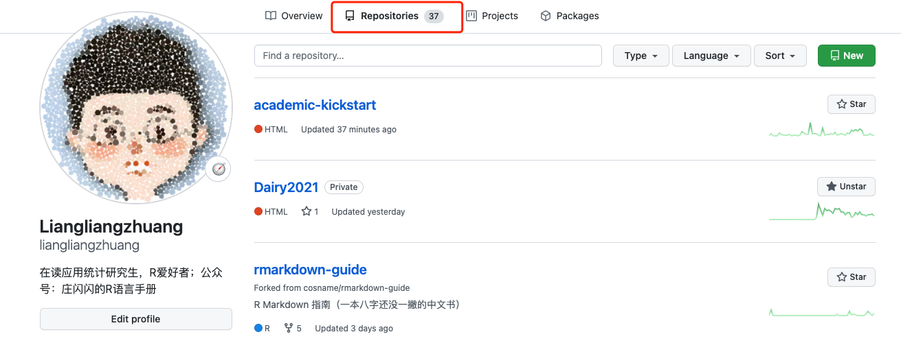

<!--more-->

# 第一次测试

## 希望没问题

### 中文没问题

图片没问题




```{r }
x = 1:10
x
plot(x)
```

```{r}
library(ggplot2)
df <- data.frame(
  gp = factor(rep(letters[1:3], each = 10)),
  y = rnorm(30)
)
ds <- do.call(rbind, lapply(split(df, df$gp), function(d) {
  data.frame(mean = mean(d$y), sd = sd(d$y), gp = d$gp)
}))

# The summary data frame ds is used to plot larger red points on top
# of the raw data. Note that we don't need to supply `data` or `mapping`
# in each layer because the defaults from ggplot() are used.
ggplot(df, aes(gp, y)) +
  geom_point() +
  geom_point(data = ds, aes(y = mean), colour = 'red', size = 3)

```

R结果有问题 输出不了
